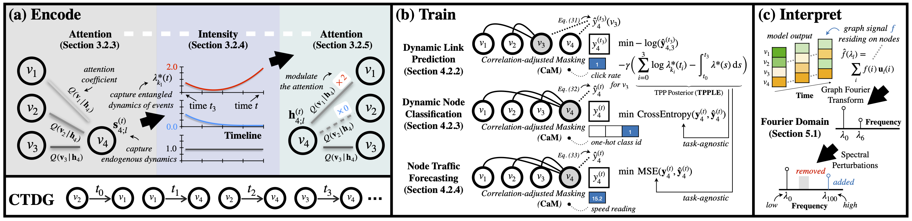

<h1 align="center"><b>EasyDGL</b></h1>
<p align="center">
    <a href="https://arxiv.org/abs/2303.12341" target="_blank"></a>
    <a href="https://proceedings.mlr.press/v139/chen21h.html"> </a>
    <a href="https://github.com/cchao0116/EasyDGL/blob/main/LICENSE"> </a>
    <a href="https://github.com/cchao0116/EasyDGL/stargazers"></a>
</p>

The official implementation for
["EasyDGL: Encode, Train and Interpret for Continuous-time Dynamic Graph Learning"](https://arxiv.org/abs/2303.12341).

<div align=center>
    
</div>

## What's news

[2023.07.28] We release the pre-version of Pytorch-DGL for traffic forecasting.

[2023.07.10] We release the pre-version of Pytorch-DGL for link prediction.

## Results for Link Prediction

### Results

Below we report the HR@50, NDCG@50 and NDCG@100 results *on the above provided dataset*.

| Model                |  HR@50  | NDCG@50 | NDCG@100 |
|:---------------------|:-------:|:-------:|:--------:|
| EasyDGL (Tensorflow) | 0.48320 | 0.23104 | 0.24476  |
| EasyDGL (Torch)      | 0.48252 | 0.23055 | 0.24378  |

## Results for Traffic Forecasting

### Results

Below we summarize the performance
with regards to different metrics and horizons
on the METR-LA dataset (see [DCRNN](https://github.com/liyaguang/DCRNN)).

|         |         | H=3  | H=6  |  H=12 |
|:--------|:-------:|:----:|:----:|------:|
| DCRNN   |   MAE   | 2.77 | 3.15 |  3.60 |
|         |  RMSE   | 5.38 | 6.45 |  7.60 |
|         | MAPE(%) | 7.30 | 8.80 | 10.50 |
| AGCRN   |   MAE   | 2.87 | 3.23 |  3.62 |
|         |  RMSE   | 5.58 | 6.58 |  7.51 |
|         | MAPE(%) | 7.70 | 9.00 | 10.38 |
| EasyDGL |   MAE   | 2.74 | 3.10 |  3.55 |
|         |  RMSE   | 5.21 | 6.17 |  7.17 |
|         | MAPE(%) | 6.96 | 8.19 |  9.81 |

### Folder Specification

- ```conf/```: configurations for logging
- ```data/```: dataset for model training and evaluation
- ```runme.sh```: train or evaluate EasyDGL and baseline models
- ```src/```: codes for model definition

### Run the Code

Here are commands for training the model 
for link prediction and traffic forecasting respectively.

``` 
python src/demo_recsys.py --config conf/model/Netflix/EasyDGL.yaml

python src/demo_traffic.py --config conf/model/METR-LA/EasyDGL.yaml
```

## Citation

If you find our codes useful, please consider citing our work

```bibtex
@inproceedings{chen2021learning,
  title={Learning Self-Modulating Attention in Continuous Time Space with Applications to Sequential Recommendation},
  author={Chen, Chao and Geng, Haoyu and Yang, Nianzu and Yan, Junchi and Xue, Daiyue and Yu, Jianping and Yang, Xiaokang},
  booktitle={Proceedings of the International Conference on Machine Learning (ICML '21)},
  pages={1606--1616},
  year={2021},
  organization={PMLR}
}

@article{chen2023easydgl,
  title={EasyDGL: Encode, Train and Interpret for Continuous-time Dynamic Graph Learning},
  author={Chen, Chao and Geng, Haoyu and Yang, Nianzu and Yang, Xiaokang and Yan, Junchi},
  journal={arXiv preprint arXiv:2303.12341},
  year={2023}
}
```
